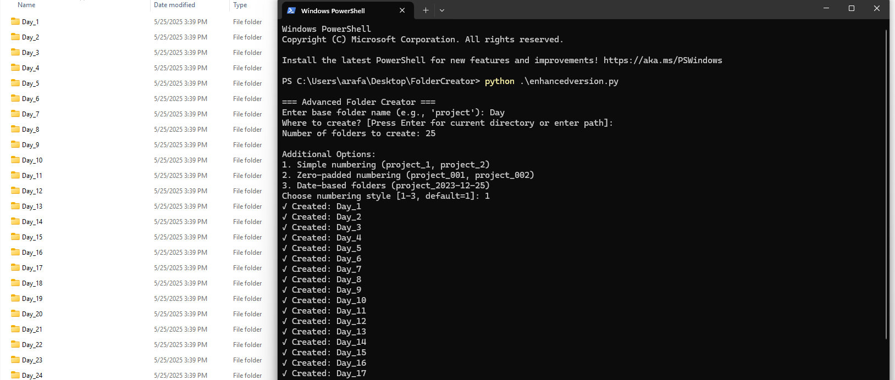

# Advanced Folder Generator   🗂️

A Python script to create multiple numbered folders with advanced naming options.

  
*(Example: Creating zero-padded folders `data_001`, `data_002`, etc.)*

## Features
✅ Create multiple folders with sequential numbering  
✅ Zero-padded numbering (e.g., `project_001`)  
✅ Date-based folder naming (`project_2025-05-25`)  
✅ Custom target directory support  
✅ Error handling for existing folders/permissions  

## Usage
1. Run the script:
   ```bash
   python enhancedversion.py